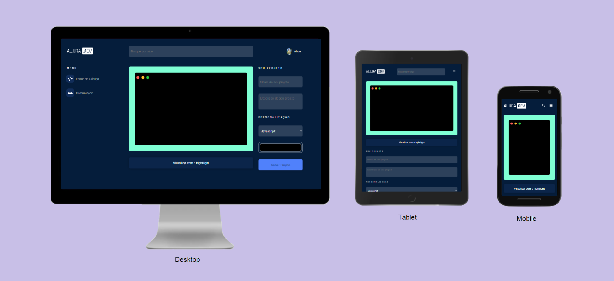

<h1 align="center">
  
</h1>

# CodeTextEditor

A aplicação é uma forma de compartilhar textos em determinadas linguagens de programação.

<p align="center">
 <a href="#layout">Layout</a> •
 <a href="#tecnologias">Tecnologias</a> •
 <a href="#pré-requisitos">Pré-requisitos</a> •
 <a href="#rodando-o-codetexteditor">Rodando o CodeTextEditor</a> •
 <a href="#autora">Autora</a>
</p>

## Layout

- [Figma](https://www.figma.com/file/Ve4hpTfmMa7yAFneoGtGKD/Alura-Challenge---Edi%C3%A7%C3%A3o-Front-end)

## Tecnologias

As seguintes ferramentas/bibliotecas foram usadas na construção do projeto:

- [Node.js](https://nodejs.org/en/)
- [React](https://pt-br.reactjs.org/)
- [React-router-dom](https://www.npmjs.com/package/react-router-dom)
- [Highlight.js](https://highlightjs.org/)
- [React-highlight](https://www.npmjs.com/package/react-highlight)
- [React-toastify](https://fkhadra.github.io/react-toastify/introduction)
- [html-to-image](https://www.npmjs.com/package/html-to-image)

## Pré-requisitos

- [Git](https://git-scm.com)
- [Node.js](https://nodejs.org/en/)
- Um editor de código, como o [VSCode](https://code.visualstudio.com/)

## Rodando o CodeTextEditor

```bash

# Clone este repositório
$ git clone <https://github.com/Alice7H/code-text-editor.git>

# Acesse a pasta do projeto no terminal/cmd
$ cd code-text-editor

# Instale as dependências
$ npm install
#ou
$ yarn install

# Execute a aplicação em modo de desenvolvimento
$ npm start
#ou
$ yarn start

# O projeto inciará na porta:3000 - acesse <http://localhost:3000>
```

## Autora

Feito com ❤️ por Alice Hata 👋🏽 [Entre em contato!](https://github.com/Alice7H/)
